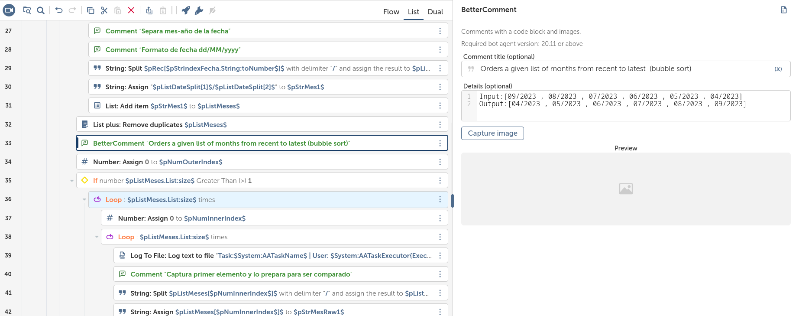
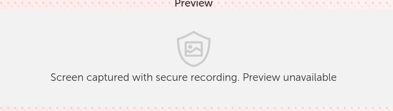
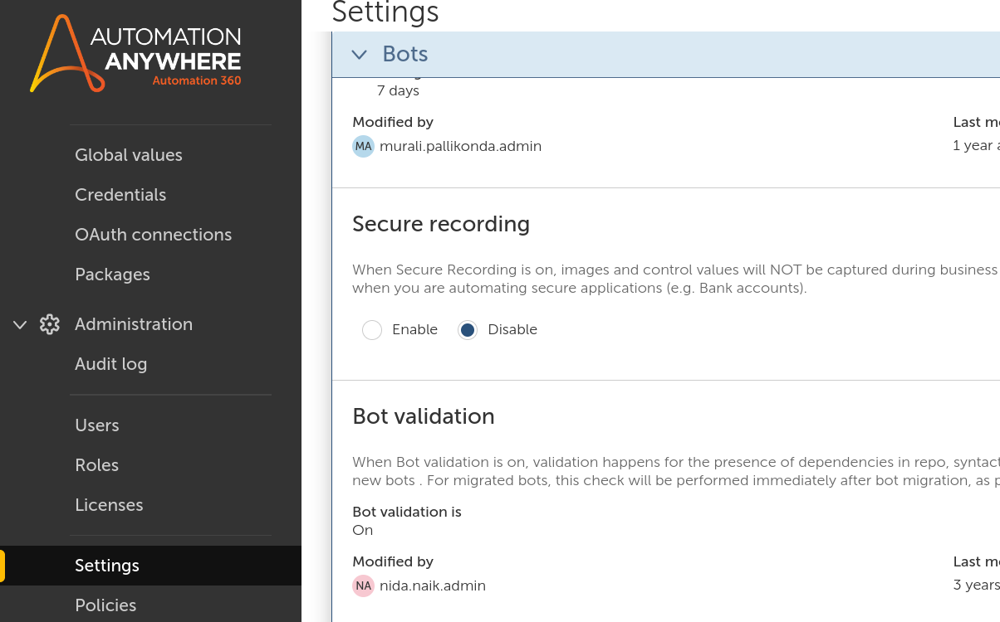
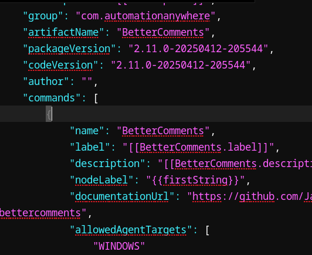

## Guide

BetterComments is a custom Automation Anywhere package designed to enhance bot documentation and maintainability. It allows you to add multi-line comments and embed images directly in your bot logic.

### Installation

1. Import the `BetterComments.jar` into your Control Room using the **Packages** section.
2. Deploy it to your bots as needed.
3. If build issues occur, refer to the patch instructions below.

> 📌 *Tip:* Use comments generously in complex loops or decision structures for better maintainability.

### Build

`gradle clean build :shadowJar`

---

## Known Issue: Image not showing when re-opening taskbot

Make sure **"Secure Recording" is disabled** in your Control Room settings.




> 🔒 **Why?**
> Secure Recording blocks image preview functionality. If it's on, image actions will run silently but nothing will show up.

**To disable it:**
1. Log in to the Control Room with an admin account.
2. Navigate to **Setting > Bots > Secure Recording**.
3. Turn off the **Secure Recording** option.



------

## Manual Fix for SDK Build Issue

**Heads-up:** The current version of the Automation Anywhere SDK has a known issue that breaks builds unless manually patched. Here’s a temporary workaround:

### Patch Instructions

1. **Extract the JAR**
   ```bash
   jar xf BetterComments-2.11.0.jar
   ```

2. **Edit `package.json`**
   Inside the extracted contents, locate the `package.json` file.
   - Open it in editor.
   - Go to the `"commands"` section.
   - **Remove any malformed or non-standard entries.**
   

3. **Repackage the JAR**
   Once cleaned, repackage the JAR:
   ```bash
   jar --create --file BetterComments-PATCHED.jar -C BetterComments-2.11.0 .
   ```
